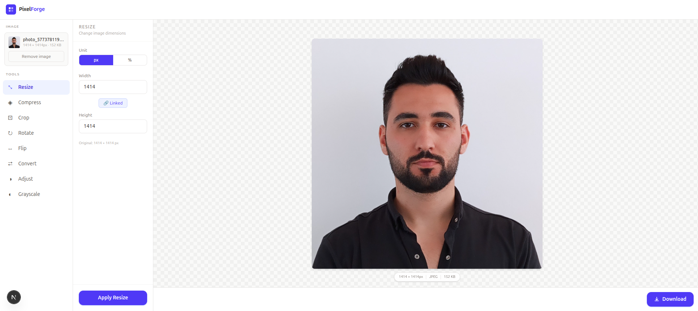

<div align="center">


# PixelForge

**A browser-based image editor — no server, no account, no limits.**

[](https://nextjs.org)
[](https://www.typescriptlang.org)
[](https://tailwindcss.com)
[](LICENSE)

[Live Demo](#) · [Report Bug](https://github.com/halimShabalout/pixelforge/issues) · [Request Feature](https://github.com/halimShabalout/pixelforge/issues)



</div>

---

## About

PixelForge is an open-source, client-side image editing tool built with Next.js. Upload any image and apply common transformations — resize, compress, crop, rotate, flip, convert format, and adjust brightness — entirely in the browser using the Canvas API.

**Your images never leave your device.**

---

## Features

| Tool | Description |
|------|-------------|
| 🔲 **Resize** | Change dimensions in pixels or percentage, with optional aspect ratio lock |
| 📦 **Compress** | Reduce file size by adjusting export quality |
| ✂️ **Crop** | Trim to a custom area or a preset aspect ratio (1:1, 4:3, 16:9…) |
| 🔄 **Rotate** | Rotate by any angle, with quick presets at 90°, 180°, 270° |
| ↔️ **Flip** | Mirror horizontally, vertically, or both |
| 🔁 **Convert** | Export as JPEG, PNG, WebP, or GIF |
| ☀️ **Adjust** | Control brightness, contrast, and saturation |
| ◑ **Grayscale** | Convert to black & white using multiple algorithms |

---

## Tech Stack

- **[Next.js 16](https://nextjs.org)** — App Router, file-based routing
- **[TypeScript](https://www.typescriptlang.org)** — fully typed codebase
- **[Tailwind CSS 4](https://tailwindcss.com)** — utility-first styling
- **Canvas API** — all image processing runs client-side, no third-party image libraries

---

## Getting Started

### Prerequisites

- Node.js 18+
- npm / yarn / pnpm

### Installation

```bash
# Clone the repository
git clone https://github.com/halimShabalout/pixelforge.git
cd pixelforge

# Install dependencies
npm install

# Start the development server
npm run dev
```

Open [http://localhost:3000](http://localhost:3000) in your browser.

### Build for Production

```bash
npm run build
npm start
```

---

## Project Structure

```
pixelforge/
├── app/
│   ├── layout.tsx              # Root layout
│   ├── page.tsx                # Landing page
│   ├── globals.css
│   └── editor/
│       ├── page.tsx            # Editor route
│       └── EditorShell.tsx     # Client shell (sidebar state)
│
├── components/
│   ├── navbar/
│   │   └── Navbar.tsx          # Top navigation bar
│   ├── sidebar/
│   │   ├── MainSidebar.tsx     # Tools list + upload (responsive drawer on mobile)
│   │   ├── SubSidebar.tsx      # Active tool options + apply button
│   │   └── UploadButton.tsx
│   ├── preview/
│   │   ├── PreviewArea.tsx     # Image canvas with drag & drop
│   │   └── DownloadButton.tsx
│   └── tools/                  # One panel per tool
│       ├── ResizePanel.tsx
│       ├── CompressPanel.tsx
│       ├── CropPanel.tsx
│       ├── RotatePanel.tsx
│       ├── FlipPanel.tsx
│       ├── ConvertPanel.tsx
│       ├── BrightnessPanel.tsx
│       └── GrayscalePanel.tsx
│
├── lib/
│   ├── editor-context.tsx      # Global image + tool state
│   └── tools.ts                # Tool definitions & constants
│
└── types/
    └── index.ts                # Shared TypeScript types
```

---

## Roadmap

- [x] Project structure & UI layout
- [x] Image upload (click + drag & drop)
- [x] Responsive layout with mobile sidebar drawer
- [ ] Resize implementation (Canvas API)
- [ ] Compress implementation
- [ ] Crop with interactive selection
- [ ] Rotate & flip
- [ ] Format conversion
- [ ] Brightness / contrast / saturation filters
- [ ] Grayscale conversion
- [ ] Undo / redo history
- [ ] Backend support for heavy processing

---

## Contributing

Contributions are welcome! Please open an issue first to discuss any change you'd like to make.

```bash
# Fork the repo, then:
git checkout -b feature/your-feature-name
git commit -m "feat: add your feature"
git push origin feature/your-feature-name
# Open a Pull Request
```

---

## License

Distributed under the MIT License. See [LICENSE](LICENSE) for more information.

---

<div align="center">
Made with ❤️ by <a href="https://github.com/halimShabalout">Halim Shabalout</a>
</div>